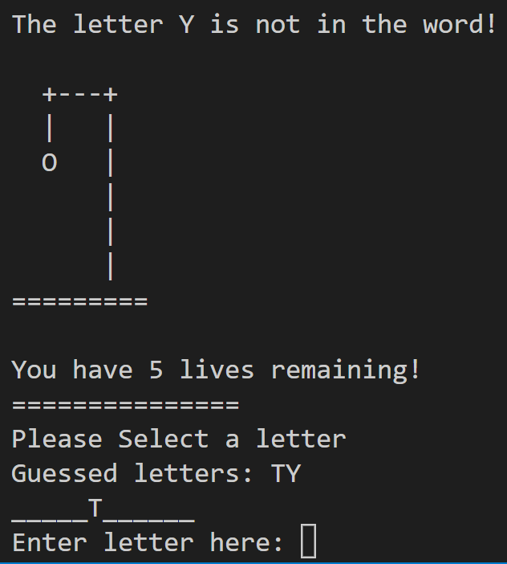

# Hangman
 Hangman is a python terminal game, users attempt to find a word by guessing letters before they make too many mistakes and run out of lives.

## How to Play 
Hangman is a classic game of hangman. You can read more here https://en.wikipedia.org/wiki/Hangman_(game)

In this version a player has six lives and guesses letters one at a time

The player will see the letters they guess correctly appear in a word otherwise marked by underscores, representing the unknown characters. For example T_TT__ where T has been guessed correctly. 

Correct guesses are marked on the word, as well as messaged to the user. Incorrect guesses are noted for the player and they lose a life, easily seen by the hangman images and life counter.

The player wins if they guess the word before the man hangs.

## Existing Features and User Stories
 - Random word selection from a list of words
 - Total lives are given and a letter is asked for as an input
 - The player can not see what the word is
 

 - Accepts user input
 - Tracks lives and previous user inputs
 - Tracks progress to finding the word
 

### Input Validation and user prompts
 - You cannot enter anything but one letter
 - Hangman game reminds you if you have already added a letter you input earlier
 - You cannot enter a blank space
 - Game prompts user to enter a letter upon receiving invalid input, without removing a life.
 

## Future Features
 - Allow the player to select between multiple libraries of words
 - Allow the player to continue playing after the game ends
 - Have hyphenated words
 - Have multiple words

## Data Model
The Hangman game uses a nested data structure and iteration with loops to track statistics and advance through the game.

The game stores the current state of the hangman, guessed letters, remaining player lives and the word randomly chosen from the list of words. Using f-strings it provides feedback to the user about the state of the game and can respond dynamically to player inputs.

## Testing
I have manually tested the code by doing the following:
 - Passed code through the pycode linter and pythonchecker.com (see below) and confirmed that there are no problems.
 - Tested in my local terminal, https://.pythontutor.com and a python compiler https://www.programiz.com/python-programming/online-compiler/
 - Given invalid inputs. A blank space and number are shown above. I have also tested multiple letters at once, letters that have already been chosen before and other common symbols: " % & . 
 

## Bug Testing
### Solved Bugs
 - I had created an infinite While loop in a function that allowed the user to choose a letter meaning the user just kept picking letters (found using python tutor). I fixed this by removing the while and integrating the selection into the games loop. 
 - I was receiving an instant game-over after one incorrect guess because I hadn't decremented the lives properly, using lives -+ lives instead of lives -= 1 
 - Fixed a bug adding strings of underscores to the make guesses list, this created many syntax errors during indexing
 - Capitalized user input so that it compares to the stored word correctly, which was already capitalized
 - Removed repeated call to print_hangman_state function when incorrect, stopping the same large image from hitting the terminal multiple times

### There are no remaining bugs

## Validator Testing
 - No substantial errors are returned using pycode (used to be pep8). Use $ pycodestyle run.py. The few errors related to whitespace and using '\' on the ascii images, which all work perfectly. 
 
 - Using python checker https://www.pythonchecker.com/ the project had no errors listed and a rating of 100%
 

## Deployment
This project was created in Github and deployed on Heroku
Steps for Deployment:
 - Fork or Clone the repository
 - Create a new Heroku app
In Settings:
 - Reveal Config Vars 'Port' in key, '8000' in value
 - Add buildpacks - python then node.js in that order, save both
In Deploy section:
 - Connect to Github
 - Search for Github repository name
 - Connect repository to app
 - Deploy the project

## Credits
 - ASCII art for lives, from 
https://gist.github.com/chrishorton/8510732aa9a80a03c829b09f12e20d9c
 - Wikipedia for details of the game